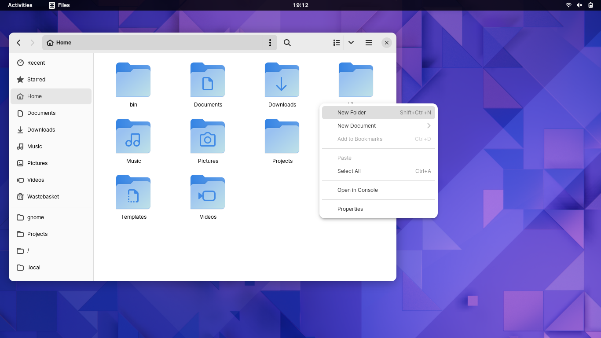
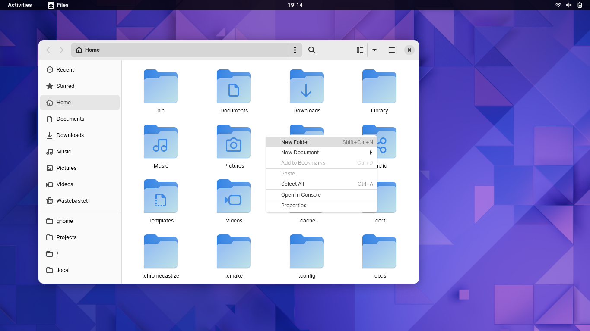

# adw-gtk-additional

gtk.css to go in ~/.config/gtk-3.0/gtk.css

Icon theme to go in ~/.local/share/icons/

Adds roundness to context menus, some additional icons to better match libadwaita (menu item arrow mostly).

With additional:

Normal:

Thanks to https://github.com/mangini210 for the basis of this whole mess: https://github.com/lassekongo83/adw-gtk3/issues/100
